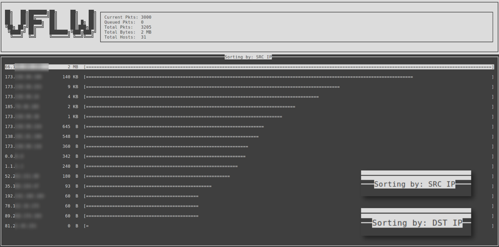
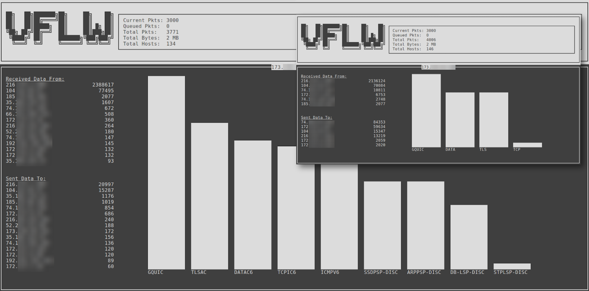

# VFLW / Visual Flow

### Simple traffic analysis

This is designed to give a glance into network traffic and protocols currently being used.

Current navigation:
- UP-ARROW/DOWN-ARROW : Move between the top source and destination ip's on the screen
- LEFT-ARROW/RIGHT-ARROW : Switch between showing SRC IP or DST IP on the main screen
- ENTER : See a SRC/DST ip's statistics include hosts it's communicating with and protocols it's using
- BACKSPACE : Leave detailed view of host

This operates on a data transfer window currently of 3000 packets but is parameterized in code.

Current stats include:
- Total packets
- Total transfer bytes in window
- Total hosts in capture
- Most common highest layers per host (Usually top are TLS, TCP, GQUIC, XMLP, DATA)
- Transfer per host in window

